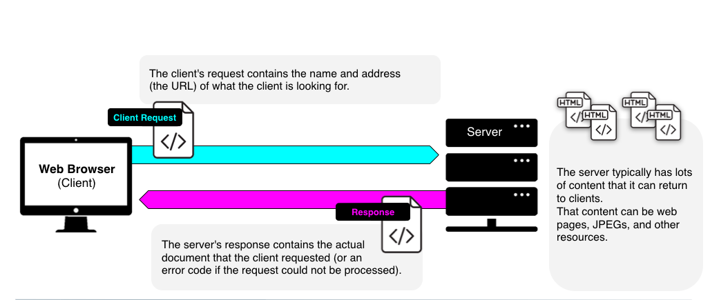

# Back-End-Programming

A repository to host various file types in an effort to organize the topics covered since Project-One completion

## ES6

1. Arrow Functions
2. Let and Block Scope
3. Constant Reference
4. Const Let Arrow
5. Functional Loops
6. Template Literals
7. For Of
8. Rest and Spread
9. Object Destructuring
10. Fetch

###### Arrow Functions

"An arrow function expression is a syntactically compact alternaive to a regular function expression, although without its own bindings to the `this`, `arguments`, `super`, or `new.target` keywords. Arrow function expressions are suited as methods, and they cannot be used as constructors.

example:

```
const materials = [
  'Hydrogen',
  'Helium',
  'Lithium',
  'Beryllium'
];

console.log(materials.map(material => material.length));
//expected output : Array[ 8, 6, 7, 9]

```

###### Let and Block Scope

"The `let` statement declares a block scope local variable, optionally initializing it to a value."

```
let x = 1;

if (x === 1) {
  let x = 2;

  console.log(x);
  // expected output: 2
}

console.log(x);
// expected output: 1

```

"A `block statement` (or compound statement in other languages) is used to group zero or more statements. The block is delimited by a pair of curly brackets and may optionally be `labelled`."

```
var x = 1;
let y = 1;

if (true) {
  var x = 2;
  let y = 2;
}

console.log(x);
// expected output: 2

console.log(y);
// expected output: 1

```

###### Constant Reference

"Constants are block-scoped, much like variables defined using the `let` statement. The value of a constant can't be changed through reassignment, and it can't be redeclared."

```
const number = 42;

try {
  number = 99;
} catch(err) {
  console.log(err);
  // expected output: TypeError: invalid assignment to const `number'
  // Note - error messages will vary depending on browser
}

console.log(number);
// expected output: 42

```

###### Const Let Arrow

We cannot reassign value to a constant reference but we can modify arrays and objects that use `const`.

```
const item = {
  id: 23,
  title: 'Underwater Basket-Weaving DVD',
  price: '$17.99'
};

item.price = '$1.99';

console.log(item);

```

###### Functional Loops

`forEach` is a functional way of iterating through an array without a for-loop."

```
moviePatrons.forEach(patron => console.log(patron.age));

```

`filter` returns a new array containing only elements whose callback returns a truthy value

```
const canWatchRatedR = moviePatrons.filter(patron => patron.age > 17);

console.log(canWatchRatedR);

```

`map` returns a brand new array the same length as the first. Each element is passed into the callback. Whatever is returned from the callback at each iteration is what goes into that index of the new array.

```
const cardedMoviePatrons = moviePatrons.map(patron => {
  patron.canWatchRatedR = patron.age >= 17;
  return patron;
});

console.log('Carded Movie Patrons: ');
console.log(cardedMoviePatrons);

```

## Node.js

#### Learning Objectives

1. Client-Server Model
2. Run Node.js applications
3. Import standard library packages
4. Initialize projects and install modules using npm
5. Build CLI applications with Inquirer

#### Client-Server Model

###### Understanding the Client

"A client is a piece of computer hardware or software that access a service made available by a server. It can be a desktop computer, laptop, mobile device, and more." -slide deck

###### Understanding the Server

"Depending on the context a server is both a physical hardware and a software that _"hears"_ requests from users and returns something. For instance, an HTML or image file, or it could complete a process."

"In modern web applications, there is constant back-and-forth communication between the visuals displayed on the user's _browser_ (**the front end**) and the data and logic stored on the _server_ (**the backend**) - slide deck



###### So, what is Node.js?

"**Node.js is an open source, cross-platform JavaScript runtime environment designed to be run outside of the browser.**

It is a general utility that can be used for a variety of purposes including asset compilation, scripting monitoring, and **most notably as the basis for web servers**. -slide deck

###### How do I use Node.js?

###### Node.js Random

- The process object

"The process object is a `global` that provides information about, and control over, the current Node.js process. As a global, it is always available to Node.js without using `require('process')`

So, what is that `process.argv` all about?

"Passing in arguments via the command line is an extremely basic programming task, and a necessity for anyone trying to write a simple Command-Line Interface (CLI). In node.js, as in C and many related environments, all command-line arguments recieved by the shell are given to the process in an array called `argv`

**`argv`** is short for **argument values**

Example:

**Simple Form**

argv.js file containing :

```
console.log(process.argv)

```

Run the following in your shell :

```
$ node argv.js one two three four five
['node',
'/home/avian/argvdemo/argv.js',
'one',
'two',
'three',
'four',
'five' ]

```

"There you have it - an array containing any arguments you passed in. Notice the first two elements- node and the path to your script. These will always be present- even if your program takes no arguments of its own, your script's interpreter and path are still considered arguments to the shell you're using."

**More Complex**

argv.js file containing :

```
const myArgs = process.argv.slice(2);
console.log('myArgs: ', myArgs);

```

would return :

```
$ node argv.js one two three four
myArgs:  [ 'one', 'two', 'three', 'four' ]

```

then you can manipulate your args :

```
const myArgs = process.argv.slice(2);
console.log('myArgs: ', myArgs);

switch (myArgs[0]) {
case 'insult':
    console.log(myArgs[1], 'smells quite badly.');
    break;
case 'compliment':
    console.log(myArgs[1], 'is really cool.');
    break;
default:
    console.log('Sorry, that is not something I know how to do.');
}
```

- Library packages

  **fs**

[fs readFile DOCS](https://nodejs.org/api/fs.html#fs_fs_readfile_path_options_callbacks)

fs is a Node library package used for reading and writing files.

```
'use strict';

const fs = require('fs');

fs.readFile('data.csv', 'utf8', function(error, data) {
  if (error) {
    return console.log(error);
  }
  console.log(data);
});

fs.writeFile('log.txt', 'hello world!', function(err) {
  if (err) {
    return console.error(err);
  }
  console.log('Success!');
});

fs.appendFile('log.txt', process.argv[2] + '\n', function(err) {
  if (err) {
    console.error(err);
  } else {
    console.log('Commit logged!');
  }
});


```

- Creating a Math Module Example

**File: index.js**

```
var maths = require('./maths');

var operation = process.argv[2];

var numOne = parseInt(process.argv[3]);
var numTwo = parseInt(process.argv[4]);

switch (operation) {
  case 'sum':
    console.log(maths.sum(numOne, numTwo));
    break;
  case 'difference':
    console.log(maths.difference(numOne, numTwo));
    break;
  case 'product':
    console.log(maths.product(numOne, numTwo));
    break;
  case 'quotient':
    console.log(maths.quotient(numOne, numTwo));
    break;
  default:
    console.log('Check your maths!');
}

```

**File: maths.js**

```
module.exports = {
  sum: function(a, b) {
    return a + b;
  },
  difference: function(a, b) {
    return a - b;
  },
  product: function(a, b) {
    return a * b;
  },
  quotient: function(a, b) {
    return a / b;
  }
};
```

**How to create your package.json file**

"From the command line

```
 run npm init.
```

Remember to run the command from within your working directory.
Follow the prompts and enter the following:

- package-name

- version number

- description

- entry point

- git repository

- keywords

- author

- license

When ready to install a package for use pull up the package.json in command line and run the package name as listed in `[ ]` :

```
npm install [package name] --save

```
